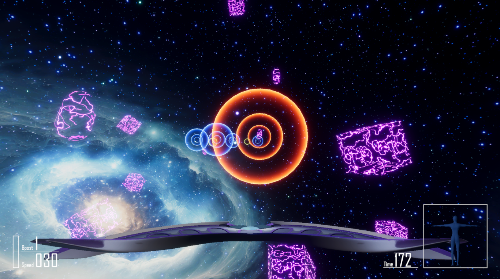
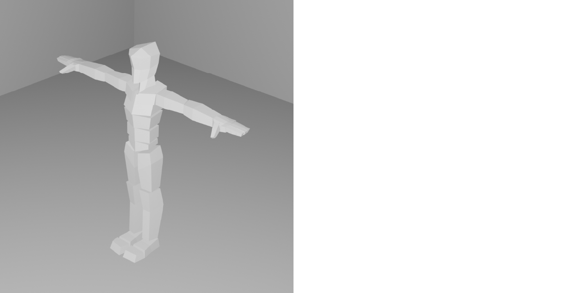
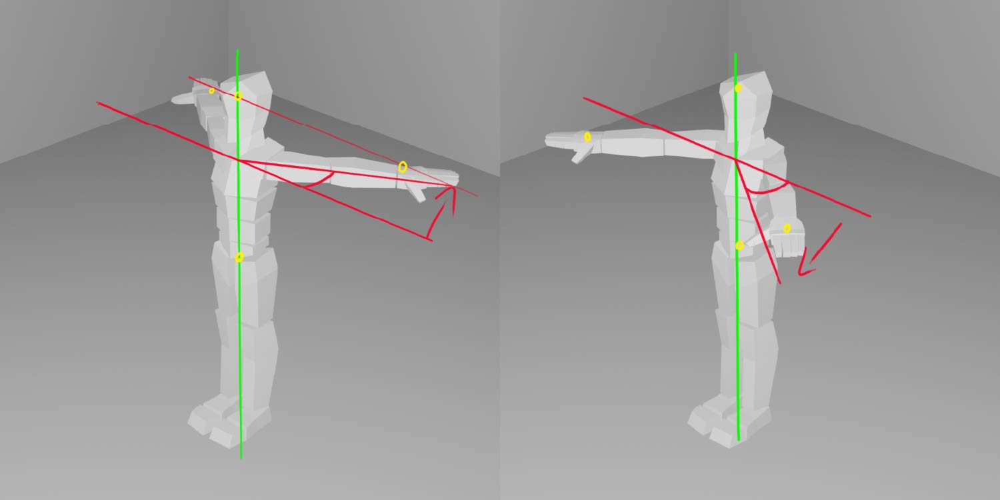
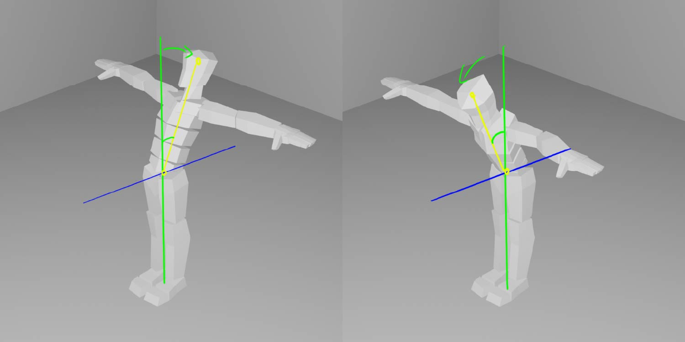
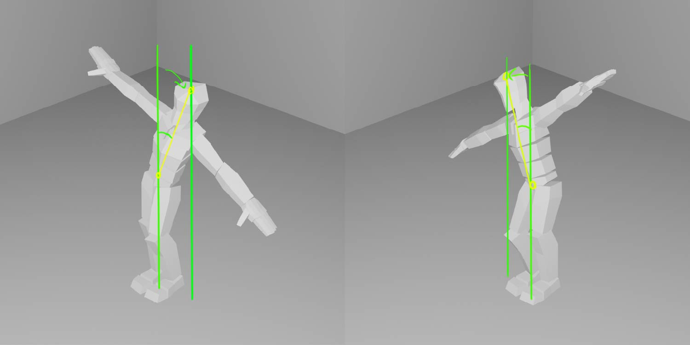
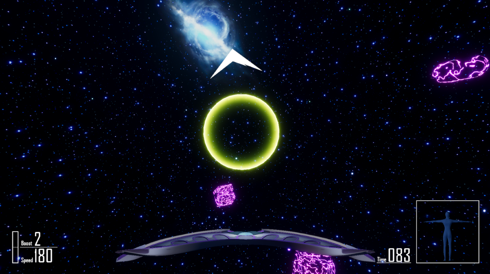
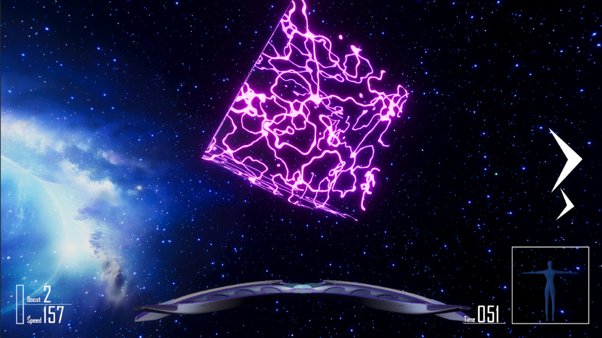

# Star Tracer
体の動きを使って宇宙船を操作するレースゲームです。

プレイ動画 
https://drive.google.com/file/d/1ujssOuoX-n-hq2_WIf2alPr4ugg3f0Wy/view?usp=drive_link

## 操作方法
### キーボード (テスト用)
- W / A / S / D で機体を操作します。  
- B ブースト  
- ESC メニュー

### ｍocopi + コントローラー
- 基本姿勢  
手を横に広げた形が基本の姿勢です。機体は速度を維持しまっすぐ進みます。

- 加速 / 減速  
手を後ろに引くと加速、前に閉じると減速します。

- 上昇 / 下降  
体を前後に倒すと、機体が上下に移動します。

- 旋回  
体を左右に倒すと倒した方向に旋回します。

- ブースト
コントローラーのトリガーボタンを押すと一定時間機体が加速します。

## 遊び方
フィールドに設置されたチェックポイントを順番に通過していき、タイムや美しさを競います。

- チェックポイント  
赤色が次にくぐるリング、青色が今後通るリングです。中心を通るほど高得点。残りブーストが＋１されます。

- ブーストリング  
触れるとブーストされます。

- 障害物  
ぶつかると減速します。ブーストを使って脱出しましょう。

## 動作環境
### 周辺機器
- mocopi
- Apple A14、Snapdragon 865以上のSoCを積んだスマートフォン
- 5GHz接続が可能なWi-Fiアクセスポイント

### PC
GPUを積んだそこそこ性能の良いもの。
#### 対応OS
- Windows10, Windows11
- macOS BigSur 以降

#### 動作確認済み環境 (Unityエディタ上でのフレームレート)
- iMac Late2015 フルスペック __約60FPS__ 
- M1 MacBook Air 8GB __約20FPS__ （メモリ不足）
- Windows11 i3-12400f, RTX3060TI, メモリ48GB __約90FPS__

### コントローラー
- Switch Joy-Con、なければXinputの物

## 開発環境
Unity  2022.3.7f1